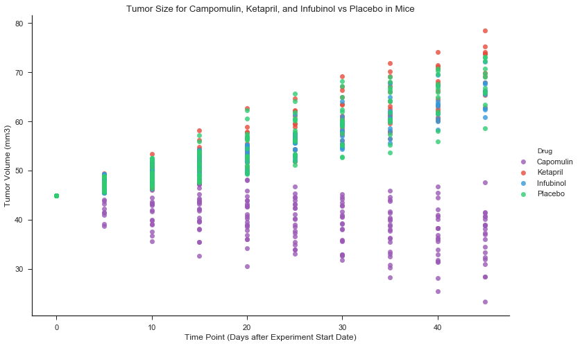
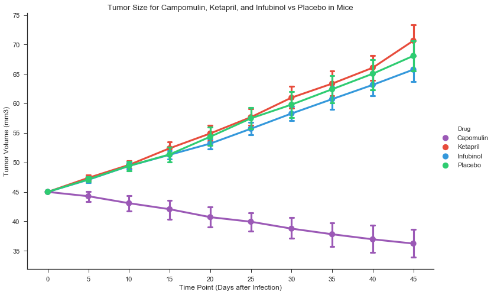
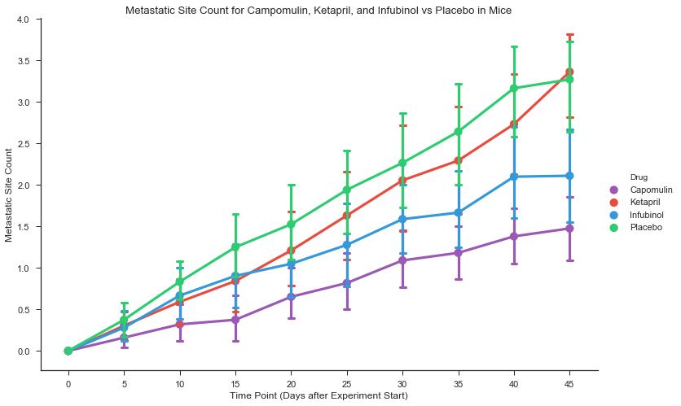
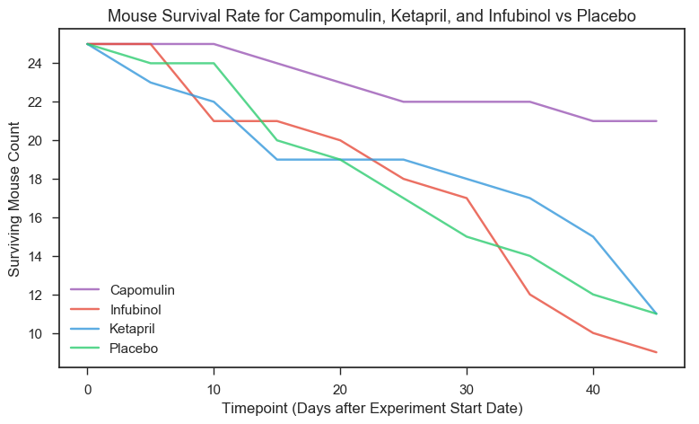
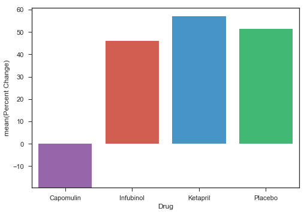

# Cancer Drug Trial in Mice

## Overview

A small company specializes in drug-based, anti-cancer pharmaceuticals. Recently, they've  begun screening for potential treatments to squamous cell carcinoma (SCC), a commonly occurring form of skin cancer.

We have complete data from their most recent animal study. In this study, 250 mice were treated through a variety of drug regimes over the course of 45 days. Their physiological responses were then monitored over the course of that time. We will show how four treatments (Capomulin, Infubinol, Ketapril, and Placebo) compare.

Below, we will create plots to show:
* How the tumor volume changes over time for each treatment.
* How the number of metastatic (cancer spreading) sites changes over time for each treatment.
* The number of mice still alive through the course of treatment (survival rate).
* The total tumor volume change for each drug across the full 45 days of the trial.


```python
# Dependencies.

import pandas as pd
import numpy as np
import os
import matplotlib.pyplot as plt
import seaborn as sns
```


```python
cd = os.path.abspath(".") # Establish current directory.

# Read our data from csv files into two data frames.

clinicalDf = pd.read_csv(os.path.join(cd, 'clinicaltrial_data.csv'))
mouseDf = pd.read_csv(os.path.join(cd, 'mouse_drug_data.csv'))
```


```python
clinicalDf.head()
```


<div>
<table border="1" class="dataframe">
  <thead>
    <tr style="text-align: right;">
      <th></th>
      <th>Mouse ID</th>
      <th>Timepoint</th>
      <th>Tumor Volume (mm3)</th>
      <th>Metastatic Sites</th>
    </tr>
  </thead>
  <tbody>
    <tr>
      <th>0</th>
      <td>b128</td>
      <td>0</td>
      <td>45.0</td>
      <td>0</td>
    </tr>
    <tr>
      <th>1</th>
      <td>f932</td>
      <td>0</td>
      <td>45.0</td>
      <td>0</td>
    </tr>
    <tr>
      <th>2</th>
      <td>g107</td>
      <td>0</td>
      <td>45.0</td>
      <td>0</td>
    </tr>
    <tr>
      <th>3</th>
      <td>a457</td>
      <td>0</td>
      <td>45.0</td>
      <td>0</td>
    </tr>
    <tr>
      <th>4</th>
      <td>c819</td>
      <td>0</td>
      <td>45.0</td>
      <td>0</td>
    </tr>
  </tbody>
</table>
</div>


```python
len(clinicalDf)
```


    1893


```python
mouseDf.head()
```


<div>
<table border="1" class="dataframe">
  <thead>
    <tr style="text-align: right;">
      <th></th>
      <th>Mouse ID</th>
      <th>Drug</th>
    </tr>
  </thead>
  <tbody>
    <tr>
      <th>0</th>
      <td>f234</td>
      <td>Stelasyn</td>
    </tr>
    <tr>
      <th>1</th>
      <td>x402</td>
      <td>Stelasyn</td>
    </tr>
    <tr>
      <th>2</th>
      <td>a492</td>
      <td>Stelasyn</td>
    </tr>
    <tr>
      <th>3</th>
      <td>w540</td>
      <td>Stelasyn</td>
    </tr>
    <tr>
      <th>4</th>
      <td>v764</td>
      <td>Stelasyn</td>
    </tr>
  </tbody>
</table>
</div>


```python
len(mouseDf)
```


    250


```python
combinedDf = pd.merge(clinicalDf, mouseDf, left_on = 'Mouse ID', right_on = 'Mouse ID', how = 'left')
```


```python
combinedDf.tail()
```


<div>
<table border="1" class="dataframe">
  <thead>
    <tr style="text-align: right;">
      <th></th>
      <th>Mouse ID</th>
      <th>Timepoint</th>
      <th>Tumor Volume (mm3)</th>
      <th>Metastatic Sites</th>
      <th>Drug</th>
    </tr>
  </thead>
  <tbody>
    <tr>
      <th>1901</th>
      <td>r944</td>
      <td>45</td>
      <td>41.581521</td>
      <td>2</td>
      <td>Capomulin</td>
    </tr>
    <tr>
      <th>1902</th>
      <td>u364</td>
      <td>45</td>
      <td>31.023923</td>
      <td>3</td>
      <td>Capomulin</td>
    </tr>
    <tr>
      <th>1903</th>
      <td>p438</td>
      <td>45</td>
      <td>61.433892</td>
      <td>1</td>
      <td>Ceftamin</td>
    </tr>
    <tr>
      <th>1904</th>
      <td>x773</td>
      <td>45</td>
      <td>58.634971</td>
      <td>4</td>
      <td>Placebo</td>
    </tr>
    <tr>
      <th>1905</th>
      <td>b879</td>
      <td>45</td>
      <td>72.555239</td>
      <td>2</td>
      <td>Stelasyn</td>
    </tr>
  </tbody>
</table>
</div>


```python
len(combinedDf)
```


    1906


```python
drugs = combinedDf[combinedDf.Drug.isin( ['Capomulin', 'Infubinol', 'Ketapril', 'Placebo'])]
drugs.head()
```


<div>
<table border="1" class="dataframe">
  <thead>
    <tr style="text-align: right;">
      <th></th>
      <th>Mouse ID</th>
      <th>Timepoint</th>
      <th>Tumor Volume (mm3)</th>
      <th>Metastatic Sites</th>
      <th>Drug</th>
    </tr>
  </thead>
  <tbody>
    <tr>
      <th>0</th>
      <td>b128</td>
      <td>0</td>
      <td>45.0</td>
      <td>0</td>
      <td>Capomulin</td>
    </tr>
    <tr>
      <th>1</th>
      <td>f932</td>
      <td>0</td>
      <td>45.0</td>
      <td>0</td>
      <td>Ketapril</td>
    </tr>
    <tr>
      <th>2</th>
      <td>g107</td>
      <td>0</td>
      <td>45.0</td>
      <td>0</td>
      <td>Ketapril</td>
    </tr>
    <tr>
      <th>3</th>
      <td>a457</td>
      <td>0</td>
      <td>45.0</td>
      <td>0</td>
      <td>Ketapril</td>
    </tr>
    <tr>
      <th>4</th>
      <td>c819</td>
      <td>0</td>
      <td>45.0</td>
      <td>0</td>
      <td>Ketapril</td>
    </tr>
  </tbody>
</table>
</div>


```python
len(drugs)
```


    777


```python
palete1 = ["#9b59b6", "#3498db", "#e74c3c", "#2ecc71"]
sns.set_palette(palete1)
sns.palplot(sns.color_palette())
plt.show()
```


```python

sns.set_context("notebook", font_scale=1.1)
sns.set_style("ticks")

tumorWeight1 = sns.lmplot('Timepoint',
                         'Tumor Volume (mm3)',
                         data = drugs,
                         fit_reg = False,
                         hue = 'Drug',
                         scatter = True,
                         size = 7,
                         aspect = 1.5
                        )
plt.title('Tumor Size for Campomulin, Ketapril, and Infubinol vs Placebo in Mice')
plt.xlabel('Time Point (Days after Experiment Start Date)')

plt.show()
# plt.ylabel('Deaths')
```





```python
# Draw a pointplot to show pulse as a function of three categorical factors
tumorWeight2 = sns.factorplot(x = "Timepoint",
                   y = "Tumor Volume (mm3)",
                   hue = "Drug",
                   data = drugs,
                   capsize = .1,
                   size = 7,
                   aspect = 1.5
                  )
plt.title('Tumor Size for Campomulin, Ketapril, and Infubinol vs Placebo in Mice')
plt.xlabel('Time Point (Days after Infection)')
# g.despine(left = True)
plt.show()
```





```python
# Draw a pointplot to show pulse as a function of three categorical factors
MetaSites = sns.factorplot(x = "Timepoint",
    y = "Metastatic Sites",
    hue = "Drug",
    data = drugs,
    capsize = .1,
    size = 7,
    aspect = 1.5
    )
plt.title('Metastatic Site Count for Campomulin, Ketapril, and Infubinol vs Placebo in Mice')
plt.xlabel('Time Point (Days after Experiment Start)')
plt.ylabel('Metastatic Site Count')
plt.show()
```





```python
drugs.head()
```


<div>
<table border="1" class="dataframe">
  <thead>
    <tr style="text-align: right;">
      <th></th>
      <th>Mouse ID</th>
      <th>Timepoint</th>
      <th>Tumor Volume (mm3)</th>
      <th>Metastatic Sites</th>
      <th>Drug</th>
    </tr>
  </thead>
  <tbody>
    <tr>
      <th>0</th>
      <td>b128</td>
      <td>0</td>
      <td>45.0</td>
      <td>0</td>
      <td>Capomulin</td>
    </tr>
    <tr>
      <th>1</th>
      <td>f932</td>
      <td>0</td>
      <td>45.0</td>
      <td>0</td>
      <td>Ketapril</td>
    </tr>
    <tr>
      <th>2</th>
      <td>g107</td>
      <td>0</td>
      <td>45.0</td>
      <td>0</td>
      <td>Ketapril</td>
    </tr>
    <tr>
      <th>3</th>
      <td>a457</td>
      <td>0</td>
      <td>45.0</td>
      <td>0</td>
      <td>Ketapril</td>
    </tr>
    <tr>
      <th>4</th>
      <td>c819</td>
      <td>0</td>
      <td>45.0</td>
      <td>0</td>
      <td>Ketapril</td>
    </tr>
  </tbody>
</table>
</div>


```python
survival = pd.DataFrame(drugs.groupby(['Timepoint','Drug']).agg({'Mouse ID' : ['count']})).reset_index()
list(survival)
```


    [('Timepoint', ''), ('Drug', ''), ('Mouse ID', 'count')]


```python
palete1 = ["#9b59b6", "#e74c3c", "#3498db", "#2ecc71"]
sns.set_palette(palete1)

figa = plt.figure(figsize=(9, 5), dpi= 100)
ax1 = figa.add_subplot(1,1,1)

for i in  survival['Drug'].unique():
    series = survival[survival['Drug'] == i]
    ax1.plot(
    series.Timepoint, 
    series['Mouse ID'],
    label = i,
    alpha=.8,
            )
ax1.legend()
ax1.set_xlabel('Timepoint (Days after Experiment Start Date)')
ax1.set_ylabel('Surviving Mouse Count')
ax1.set_title('Mouse Survival Rate for Campomulin, Ketapril, and Infubinol vs Placebo')
plt.show()
```





```python
drugs.head()
```


<div>
<table border="1" class="dataframe">
  <thead>
    <tr style="text-align: right;">
      <th></th>
      <th>Mouse ID</th>
      <th>Timepoint</th>
      <th>Tumor Volume (mm3)</th>
      <th>Metastatic Sites</th>
      <th>Drug</th>
    </tr>
  </thead>
  <tbody>
    <tr>
      <th>0</th>
      <td>b128</td>
      <td>0</td>
      <td>45.0</td>
      <td>0</td>
      <td>Capomulin</td>
    </tr>
    <tr>
      <th>1</th>
      <td>f932</td>
      <td>0</td>
      <td>45.0</td>
      <td>0</td>
      <td>Ketapril</td>
    </tr>
    <tr>
      <th>2</th>
      <td>g107</td>
      <td>0</td>
      <td>45.0</td>
      <td>0</td>
      <td>Ketapril</td>
    </tr>
    <tr>
      <th>3</th>
      <td>a457</td>
      <td>0</td>
      <td>45.0</td>
      <td>0</td>
      <td>Ketapril</td>
    </tr>
    <tr>
      <th>4</th>
      <td>c819</td>
      <td>0</td>
      <td>45.0</td>
      <td>0</td>
      <td>Ketapril</td>
    </tr>
  </tbody>
</table>
</div>


```python
# To get the overall change in tumor size by drug, group our original drug dataframe by timepoint and drug name
# aggregating the tumor volume with mean().

tumor = pd.DataFrame(drugs.groupby(['Timepoint','Drug']).agg({'Tumor Volume (mm3)' : ['mean']})).reset_index()
```


```python
tumor.head()
```


<div>
<table border="1" class="dataframe">
  <thead>
    <tr>
      <th></th>
      <th>Timepoint</th>
      <th>Drug</th>
      <th>Tumor Volume (mm3)</th>
    </tr>
    <tr>
      <th></th>
      <th></th>
      <th></th>
      <th>mean</th>
    </tr>
  </thead>
  <tbody>
    <tr>
      <th>0</th>
      <td>0</td>
      <td>Capomulin</td>
      <td>45.000000</td>
    </tr>
    <tr>
      <th>1</th>
      <td>0</td>
      <td>Infubinol</td>
      <td>45.000000</td>
    </tr>
    <tr>
      <th>2</th>
      <td>0</td>
      <td>Ketapril</td>
      <td>45.000000</td>
    </tr>
    <tr>
      <th>3</th>
      <td>0</td>
      <td>Placebo</td>
      <td>45.000000</td>
    </tr>
    <tr>
      <th>4</th>
      <td>5</td>
      <td>Capomulin</td>
      <td>44.266086</td>
    </tr>
  </tbody>
</table>
</div>


```python
tumor['Drug'].unique()
```


    array(['Capomulin', 'Infubinol', 'Ketapril', 'Placebo'], dtype=object)


```python
tumorChanges = []
for drug in tumor['Drug'].unique():
    minimum = tumor[tumor['Drug'] == drug]['Timepoint'].idxmin()
    maximum = tumor[tumor['Drug'] == drug]['Timepoint'].idxmax()
    maxWeight = tumor.iloc[maximum]['Tumor Volume (mm3)'].values 
    minWeight = tumor.iloc[minimum]['Tumor Volume (mm3)'].values 
    tumorChanges.append([drug, round(float((maxWeight - minWeight)/minWeight*100), 2)])
```


```python
tumorChange = pd.DataFrame(tumorChanges, columns=['Drug', 'Percent Change'])
tumorChange
```


<div>
<table border="1" class="dataframe">
  <thead>
    <tr style="text-align: right;">
      <th></th>
      <th>Drug</th>
      <th>Percent Change</th>
    </tr>
  </thead>
  <tbody>
    <tr>
      <th>0</th>
      <td>Capomulin</td>
      <td>-19.48</td>
    </tr>
    <tr>
      <th>1</th>
      <td>Infubinol</td>
      <td>46.12</td>
    </tr>
    <tr>
      <th>2</th>
      <td>Ketapril</td>
      <td>57.03</td>
    </tr>
    <tr>
      <th>3</th>
      <td>Placebo</td>
      <td>51.30</td>
    </tr>
  </tbody>
</table>
</div>


```python
# palete1 = ["#9b59b6", "#3498db", "#e74c3c", "#2ecc71"]
# sns.set_palette(palete1)

bar1 = sns.barplot('Drug', 'Percent Change', data=tumorChange)
plt.show()
```





```python
## Some Conclusions


```


```python

```
